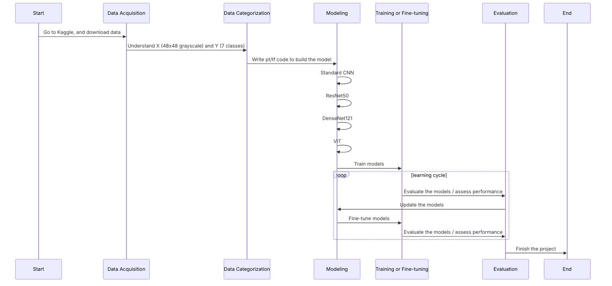

```mermaid
%%{init: {'theme': '', 'themeVariables': { 'fontSize': '150px', 'fontFamily': 'Inter'}}}%%
sequenceDiagram
  participant S as Start
  participant DTA as Data Acquisition
  participant DCAT as Data Categorization
  participant MOD as Modeling
  participant TR as Training or Fine-tuning
  participant EV as Evaluation
  participant ED as End

  S->>DTA: Go to Kaggle, and download data
  DTA->>DCAT: Understand X (48x48 grayscale) and Y (7 classes)
  DCAT->>MOD: Write pt/tf code to build the model
  MOD->>MOD: Standard CNN
  MOD->>MOD: ResNet50
  MOD->>MOD: DenseNet121
  MOD->>MOD: ViT
  MOD->>TR: Train models
  loop learning cycle
    TR->>EV: Evaluate the models / assess performance
    EV->>MOD: Update the models
    MOD->>TR: Fine-tune models
    TR->>EV: Evaluate the models / assess performance
  end
  EV->>ED: Finish the project
```
